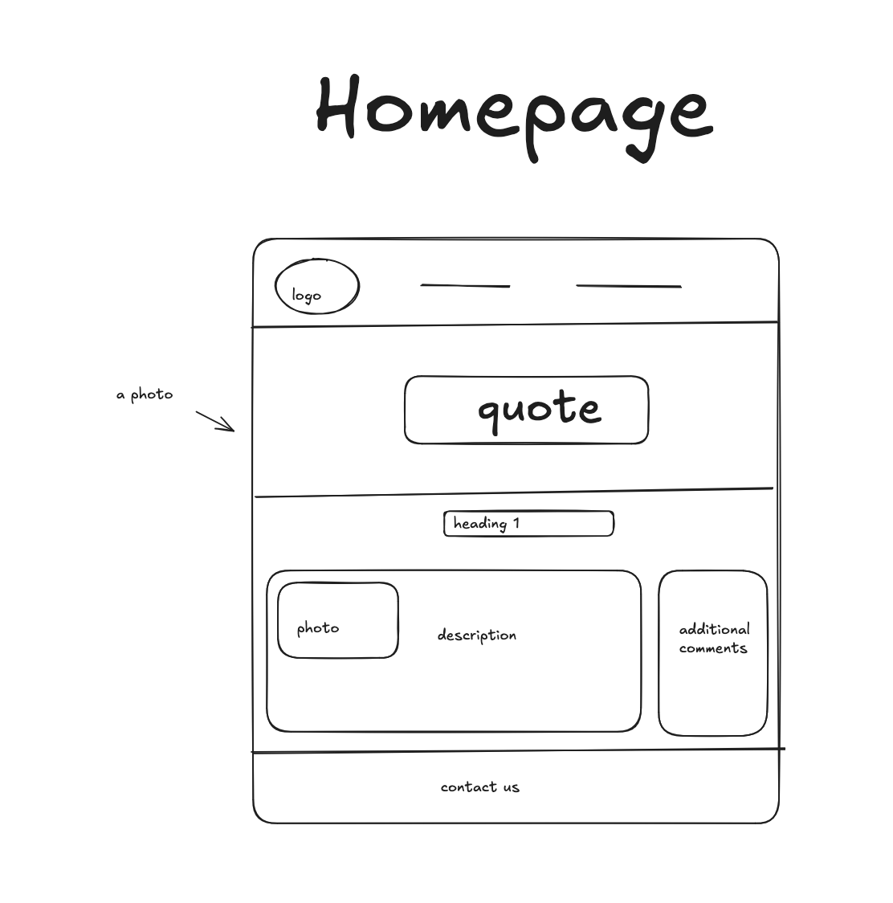
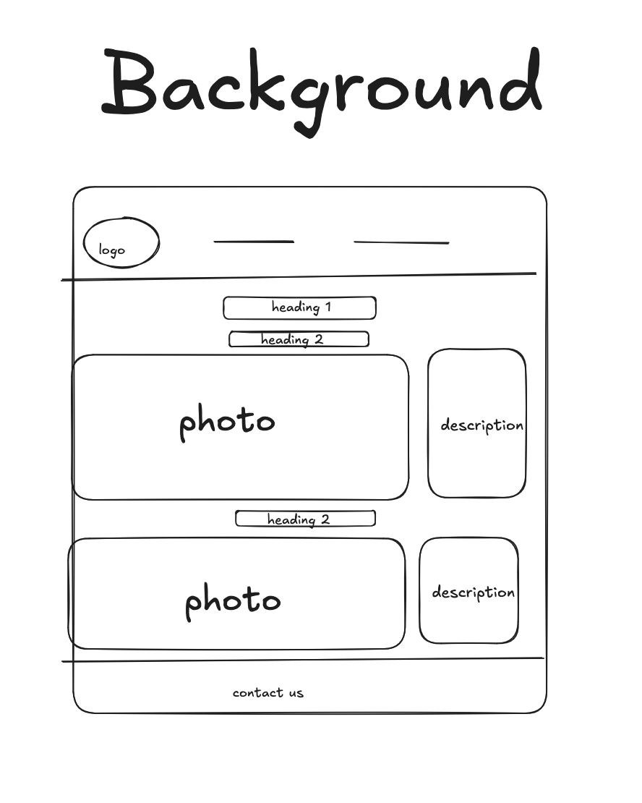
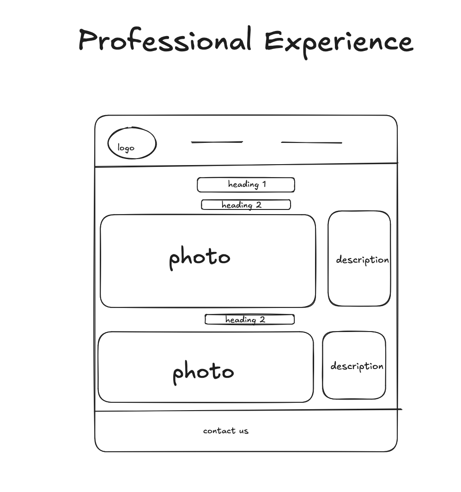

# The Developping Process

My client is my cousin, Tokio, who lives in Japan.

## Phase 1: Discovery & Planning

He wanted a portfolio website in case of job changes. 
The target audience will be the interviewer of that new job.
He didn't have a clear idea of what colors to use, 
but he said he perfers bright colors that stand out.

After listening to what he wants, I sketched a mock up, which he liked.

## Phase 2: Iterative Development

After working on the design, I worked on creating and designing the website.

1/26, Through email, we checked and talked on the mostly finished 
index.html page, because I wasn't finished with the other two webpages.

He said that he likes the color and the design, but also wanted to be able to
have links to jump to the other two webpages, which I totally forgot.

Additionally, he gave me images I should use, 
and I was off to getting things done.

## Phase 3: Final Delivery

